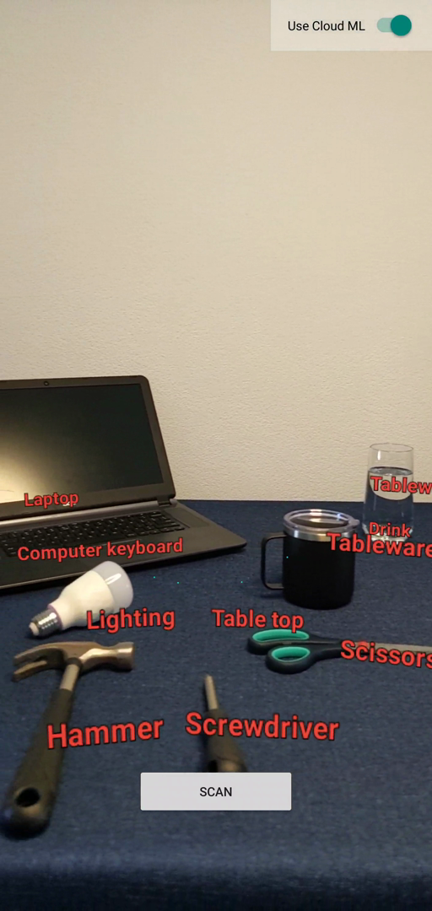

# ARCore ML sample

An [ARCore](https://developers.google.com/ar) sample demonstrating how to use
camera images as an input for machine learning algorithms, and how to use the
results of the inference model to create anchors in the AR scene.

<p align="center">
  
</p>

This sample uses ML Kit's [Object Detection](https://developers.google.com/ml-kit/vision/object-detection)
and (optionally) Google Cloud's [Vision API](https://cloud.google.com/vision/docs/object-localizer)
to infer object labels from camera images.

## Getting Started
To try this app, you'll need the following:

 * An ARCore compatible device running [Google Play Services for AR](https://play.google.com/store/apps/details?id=com.google.ar.core) (ARCore) 1.24 or later
 * Android Studio 4.1 or later

### Configure ML Kit's classification model
By default, this sample uses ML Kit's built-in coarse classifier, which is only built for five categories and provides limited information about the detected objects.

For better classification results:

1. Read [Label images with a custom model on Android](https://developers.google.com/ml-kit/vision/object-detection/custom-models/android)
   on ML Kit's documentation website.
2. Modify `MLKitObjectAnalyzer.kt` in `src/main/java/com/google/ar/core/examples/java/ml/mlkit/` to specify a custom model.

### \[Optional] Configure Google Cloud Vision API
This sample also supports results from Google Cloud's [Vision API](https://cloud.google.com/vision/docs/object-localizer) for even more information on detected objects.

To configure Google Cloud Vision APIs:

1. Follow steps for configuring a Google Cloud project, enabling billing, and enabling the Vision API on [Set up the Vision API documentation](https://cloud.google.com/vision/docs/setup).
1. [Create an API key](https://cloud.google.com/docs/authentication/api-keys#creating_an_api_key) for your project.
1. Add the API key to the application's `AndroidManifest.xml`:

   ```xml
  <application
      android:icon="@drawable/ic_launcher"
      android:label="ARCore ML"
      …>
    …
    <meta-data android:name="com.google.ar.core.examples.kotlin.ml.API_KEY" android:value="API_KEY_HERE" />
  </application>
   ```

